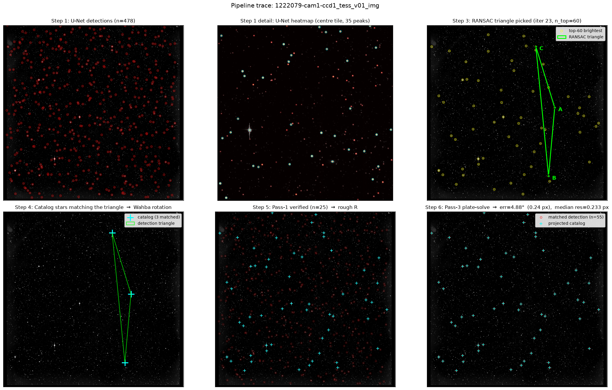

# Star Tracker — Spacecraft Attitude Determination from Real Satellite Imagery

**Blind spacecraft-attitude estimation on real NASA TESS imagery, built with deep
learning + classical geometry.** Given a single image plus calibrated camera intrinsics
(SIP, CRPIX, and de-rotated CD scale/shear), the pipeline identifies the star field and
recovers all three attitude degrees of freedom without an initial pose or IMU prior.

### 🎯 [Try the live interactive demo →](https://star-tracker-6vwnvtkvpow2eysg23i45l.streamlit.app)

*Walks through every pipeline stage with the actual numbers (detections, triangle, plate-solve,
quality gate, final pose) on 16 real TESS images. Replay mode renders in ~5 seconds; Live mode
runs the full RANSAC + plate-solve.*


*Six pipeline stages: from raw TESS frame to attitude quaternion.*

---

## Results in one table

End-to-end lost-in-space attitude on the full real-TESS test split. Thirteen frames
without WCS calibration are reported as data exclusions; solve rate is measured over
the 107 valid frames.

| Metric | Value |
|---|---|
| Attitude solve rate | **104 / 107 (97.2%)** |
| Median angular error | **8.98″** (0.44 px at 20.57″/px) |
| 90th percentile | **19.41″** (0.94 px) |
| Cross-boresight / roll median | **2.74″ / 8.33″** |
| Below one pixel | **95 / 104** solved frames |
| Below one arcminute | **104 / 104** solved frames |
| False locks | **0** — three candidates honestly refused |

The repository bundles a compact 16-frame replay/demo subset: **15/16 solved,
6.63″ median, 0 false locks**. Machine-readable full-test metrics are in
[`Results/full_test_metrics.json`](Results/full_test_metrics.json), with all
120 frame outcomes in
[`Results/full_test_per_frame.csv`](Results/full_test_per_frame.csv).

Detector benchmark (centroid quality, `--use-gt` mode, 120 test images):

| Detector | Parameters | Median error |
|---|---:|---:|
| U-Net  | 7.76 M | 4.6″ |
| HRNet  | **3.99 M** | 4.8″ |

The medians differ by only 0.2″ while HRNet uses half the parameters. This suggests
that detector architecture is not the dominant accuracy bottleneck; a formal paired
confidence interval remains future work.

---

## What this is

A complete star-tracker pipeline that converts a single sky image into a camera
attitude quaternion, given the camera's calibrated intrinsics. Validated on
**real TESS satellite imagery** (not simulations), in *lost-in-space*
mode — no initial pose guess, no IMU prior, and no supplied catalog correspondences.
RANSAC/Wahba initializes RA, Dec, and physical body roll; the label WCS is used
only to supply camera calibration and to score the final result.

```
        PNG image (2136 × 2078) + camera intrinsics (SIP + CRPIX + CD)
                │
                ▼
   ┌────────────────────────────┐
   │  Stage 1 — CNN detection   │   U-Net / HRNet → ~480 sub-pixel centroids
   └────────────────────────────┘
                │
                ▼
   ┌────────────────────────────┐
   │  Stage 2 — Body vectors    │   SIP-corrected gnomonic projection
   └────────────────────────────┘
                │
                ▼
   ┌────────────────────────────┐
   │  Stage 3 — Triangle ID     │   RANSAC + Hipparcos pair-DB + 3-point Wahba SVD
   └────────────────────────────┘
                │
                ▼
   ┌────────────────────────────┐
   │  Stage 4 — Refine R        │   Wahba refit on all verified detections
   └────────────────────────────┘
                │
                ▼
   ┌────────────────────────────┐
   │  Stage 5 — Plate-solve     │   scipy least-squares over (RA, Dec, roll)
   └────────────────────────────┘
                │
                ▼
   ┌────────────────────────────┐
   │  Stage 6 — Quality gate    │   honest "no-solution" if residual > 2 px
   └────────────────────────────┘
                │
                ▼
       Attitude quaternion
```

---

## Why I think this is interesting

1. **Real satellite data, not synthetic.** Most public star-tracker projects train
   and evaluate on procedurally generated star fields. TESS images carry real noise,
   real optical distortion, real diffraction spikes, and saturated bright stars.

2. **Diagnosed a non-obvious failure mode.** Initial linear pinhole geometry hid a
   200–1000″ residual at the field corners (TESS uses a 6th-order SIP polynomial for
   its 12° FOV). The oracle-correspondence `--use-gt` benchmark looked excellent
   (4.6″ median) but
   the catalog-based end-to-end pipeline silently failed on every image. The fix was
   to apply SIP correction via `astropy.wcs.sip_pix2foc` before the projection — a
   small change with a large effect.

3. **Two-pass refinement.** RANSAC Wahba lock + scipy plate-solve. The first finds a
   rough constellation; the second turns that into sub-pixel attitude by minimizing
   pixel residuals through the SIP forward projection.

4. **A quality gate.** Wrong locks fail loudly rather than silently. Production star
   trackers can't return wildly wrong attitudes; this pipeline refuses to answer
   when the post-solve median Euclidean per-star residual exceeds 2 px.

5. **Interactive walkthrough.** Streamlit app runs every stage live with real numbers,
   not just plots.

---

## Try it

Requires Python ≥ 3.10.

```bash
git clone https://github.com/SpaceDevEngineer/star-tracker.git
cd star-tracker
python3 -m venv .venv
source .venv/bin/activate          # Windows: .venv\Scripts\activate
python3 -m pip install -r requirements.txt
```

> **First-run expectations.** The first invocation builds and caches a Hipparcos
> pair-angle database (~60–90 s). RANSAC convergence is image-dependent:
> easy images finish in seconds, while harder fields can take several minutes.
> Replay mode avoids this wait and is the recommended way to explore the demo.

### Interactive Streamlit walkthrough

```bash
streamlit run Code/Streamlit_app/pipeline_app.py
```

Opens at <http://localhost:8501>. Pick one of the 16 demo TESS images in the
sidebar and press *Run pipeline*. Each stage materialises with the actual body
vectors, triangle-angle table, plate-solve iterations, and a final pose
comparison against the ground truth.

### End-to-end batch evaluation

```bash
python3 Code/Star_ID/inference_full.py \
    --data-dir Data/dataset_tess_test \
    --model    Results/unet_run3/best_model.pt \
    --catalog  Data/hybrid/catalog_hipparcos_full.csv \
    --mag-limit 7.5 \
    --out-dir  Results/star_id_run
```

Writes per-image JSON artefacts to `--out-dir` and prints a summary table
(solve rate, median / 90th-pct / max error) to stdout.

### Generate the visualisations

```bash
python3 Code/Star_ID/visualize_inference.py \
    --data-dir Data/dataset_tess_test \
    --run-dir  Results/star_id_run \
    --out-dir  Results/star_id_run/viz
```

Produces per-image overlays (detections + projected catalog + match lines),
per-star residual maps, and a project summary chart.

---

## Repository layout

```
star-tracker/
├── README.md              ← this file
├── PROJECT_DESCRIPTION.md ← longer technical write-up
├── RESULTS.md             ← detailed results tables
├── requirements.txt
├── Code/
│   ├── Star_ID/
│   │   ├── inference_full.py       ← main lost-in-space pipeline
│   │   ├── triangle_id.py          ← RANSAC star identification
│   │   ├── normalize_result_conventions.py
│   │   ├── summarize_results.py       ← auditable result-table export
│   │   ├── visualize_inference.py  ← per-image diagnostic plots
│   │   └── visualize_pipeline.py   ← 6-panel pipeline trace
│   ├── Model_train_code/train.py   ← U-Net architecture + training
│   ├── HRNet_train/                ← HRNet architecture + training + inference
│   ├── Tess_Dataset/process_tess.py ← FITS → PNG + JSON labels (with SIP WCS)
│   └── Streamlit_app/pipeline_app.py
├── Data/
│   ├── dataset_tess_test/  ← 16 TESS demo images + labels (28 MB)
│   └── hybrid/             ← Hipparcos catalog (5 MB)
└── Results/
    ├── full_test_metrics.json       ← aggregate 120-frame summary
    ├── full_test_per_frame.csv      ← one auditable row per frame
    └── unet_run3/best_model.pt      ← trained U-Net weights (30 MB)
```

The trained HRNet weights, full 800-image training set, and FITS archives live with the
research project; this repo carries only what's needed for the demo and to read the code.

---

## Tech stack

**Languages & ML:** Python, PyTorch (U-Net + HRNet, heatmap regression), NumPy, SciPy
(SVD + nonlinear least-squares).
**Astronomy / geometry:** Astropy (FITS, WCS, SIP polynomial), gnomonic projection,
quaternion algebra.
**Algorithms:** RANSAC, Wahba's problem, chirality-filtered triangle matching,
two-pass plate-solving.
**Tooling:** Streamlit (interactive demo), Matplotlib (visualisations), SLURM (training).

---

## Limitations and honest caveats

- **Calibration source.** The evaluation reads SIP, CRPIX, and CD from each TESS
  WCS, then explicitly factors the rotational component out of CD. A flight
  implementation would estimate and store one stable intrinsic calibration per CCD.
- **Residual calibration error.** Remaining corner-dependent distortion limits the
  corrected full-test median to 8.98″. A dedicated per-CCD residual map is the next
  accuracy lever.
- **Variable CPU latency.** Pair-angle lookup, vectorized third-star search, and
  FOV-cone verification are implemented, but RANSAC convergence still varies from
  seconds to several minutes depending on the field.
- **Honest abstention.** Three of 107 valid full-test frames were refused by the
  quality gate. All 104 published solutions remain below one arcminute.

---

## Acknowledgements

NASA TESS mission for the public TICA Full-Frame-Image data. The Hipparcos catalog
team for the reference star positions used in catalog matching.

---

## Author

Temur Kuchkorov · Master's thesis project, 2025–2026.
[Email](mailto:timka02qochqorov@gmail.com) · [LinkedIn](https://www.linkedin.com/in/temurkuchkorov/)

## License

MIT — see [LICENSE](LICENSE).
