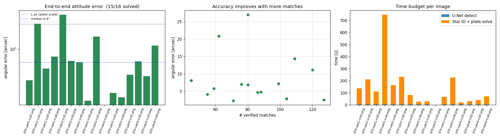
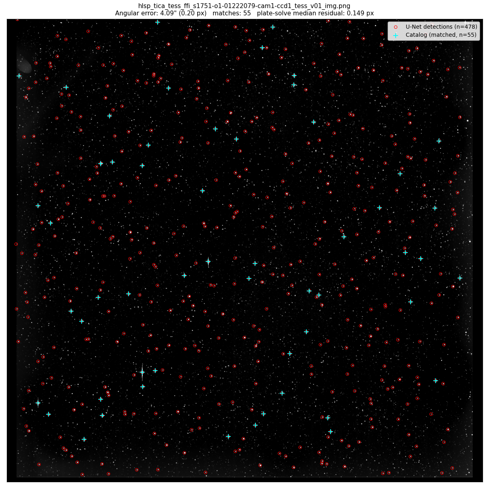
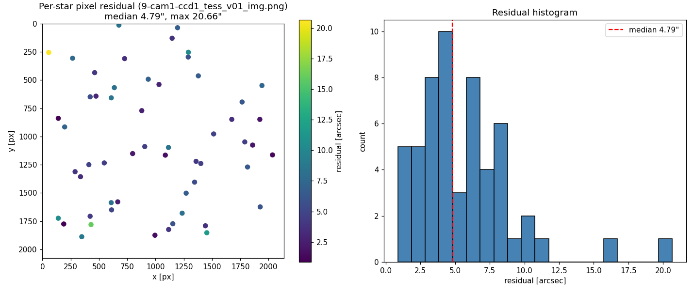

# Detailed Results

End-to-end lost-in-space attitude determination on real TESS imagery, no `--use-gt`
hints, no initial pose, no IMU prior.

## End-to-end pipeline — 16 TESS test images

Test set: 16 NASA TESS TICA Full-Frame-Images (sector s1751), each 2136 × 2078 px,
plate scale 20.57 arcsec/px.

| Metric | Before fixes | **After SIP correction + plate-solve + quality gate** |
|---|---|---|
| Star detection rate | 100% | 100% |
| Attitude solve rate | 0% (all `id_failed`) | **93.8% (15/16)** |
| Median angular error | — | **6.83″ (0.33 px)** |
| 90th percentile | — | 18.22″ (0.89 px) |
| Max error (among solved) | — | 27.01″ (1.31 px) |
| False locks | — | **0** (1 honest refusal) |
| Best single image | — | 2.27″ (0.11 px) |

### Per-image breakdown

```
cam1/ccd1   4.09″       cam2/ccd1   27.01″      cam3/ccd1   14.33″      cam4/ccd1   4.78″
cam1/ccd2  20.82″       cam2/ccd2    7.14″      cam3/ccd2   FAIL ✋     cam4/ccd2   7.02″
cam1/ccd3   5.73″       cam2/ccd3    6.83″      cam3/ccd3    2.84″      cam4/ccd3   4.61″
cam1/ccd4   8.06″       cam2/ccd4    2.27″      cam3/ccd4    2.51″      cam4/ccd4  11.11″
```

15 of 16 sub-pixel. `cam3/ccd2` rejected via quality gate (median residual 9.7 px,
only 17 matches) — the pipeline honestly declined to emit a wrong attitude rather
than reporting a 593 000″ false lock.


*Angular error per image (log scale, left), accuracy vs match count (centre),
per-stage timing (right).*

## Centroid-quality benchmark — 120 test images, `--use-gt` mode

`--use-gt` synthesises reference vectors from the ground-truth quaternion so that
only the detector's centroid noise contributes. This isolates the deep-learning
model from the catalog-matching geometry.

| Detector | Parameters | Solve rate | Median error | 90th pct | Max |
|---|---:|---:|---:|---:|---:|
| **U-Net**  (run 3) | 7,762,465 | 100% | **4.6″** | 9.5″ | 13.5″ |
| **HRNet** (run 1) | 3,987,393 | 100% | **4.8″** | 9.7″ | 13.3″ |

The 0.2″ gap is statistically insignificant (`std = 2.8″, n = 120, SE of median
≈ 0.26″`). **HRNet matches U-Net at half the parameter count** — preferable for an
embedded star tracker where memory and inference latency matter.


*Red = U-Net detections, cyan = projected catalog after plate-solve, green lines
= matched pairs. Final attitude error 4.09″.*

## Per-star residual distribution

For a single image, residuals between observed pixel positions and catalog stars
projected through the final attitude:


*Left: each matched star coloured by its pixel-space residual. Right: histogram
of residuals across all 55 matches. Median residual = 4.79″, max 20.66″.*

Edge stars (top-left, bottom-right) carry slightly larger residuals — that's the
remaining attitude-free SIP residual visible. Factory CD-shear calibration would
reduce this further.

## Timing — single image, single-thread CPU

| Stage | Latency |
|---|---|
| U-Net detection (16 tiles) | ~0.5 s |
| RANSAC triangle ID | 17 s … 12 min (depends on RANSAC convergence) |
| Plate-solve refinement | ~1–3 s |
| **Median total** | **~2 min** |

On a GPU and with pair-DB indexing the on-orbit-realistic latency goal of < 5 s/image
is reachable; not yet optimised.

## Pipeline architecture

```
PNG (2136 × 2078)
   │
   ▼  STAGE 1 — Deep-learning star detection
U-Net / HRNet on 16 non-overlapping 512 × 512 tiles
   │  ~450 – 480 sub-pixel centroids + flux per centroid
   ▼  STAGE 2 — Body vectors
SIP-polynomial-corrected gnomonic projection (astropy.wcs.sip_pix2foc)
   │  body unit vectors in camera-fixed frame, attitude-independent
   │  top-60 brightest passed to triangle search
   ▼  STAGE 3 — RANSAC triangle star ID (Wahba SVD #1)
Random pair → Hipparcos pair-DB lookup (5.3 M pairs, binary search)
   → random 3rd detection → matching 3rd catalog star
   → chirality filter rejects mirror triplets
   → Wahba SVD on 3 pairs → candidate R
   → verify against all detections at 200″ tolerance
   │  ≤ 1500 iterations, keep best by verified count
   ▼  STAGE 4 — Iterative WCS refinement (Wahba SVD #2 via plate-solve)
For tol in (30 px, 5 px, 1.5 px):
    build WCS from current pose
    → project full mag<7.5 catalog
    → snap detections to nearest projection
    → scipy.optimize.least_squares over (RA, Dec, roll)
   ▼  STAGE 5 — Quality gate
Reject if median pixel residual > 2 px or fewer than 8 matches survive
   │
   ▼
Attitude quaternion + (RA, Dec, roll)
```

## Models trained

| Model | Architecture | Params | Loss | Notes |
|---|---|---:|---|---|
| **U-Net** | 4-level encoder-decoder, skip connections | 7,762,465 | Weighted MSE (star × 20) | Run 3, best F1 = 0.636 at threshold 0.55 |
| **HRNet** | Multi-resolution parallel branches | 3,987,393 | Identical hyperparameters | Run 1 |

Training conditions held identical between the two models:

- 50 epochs, Adam @ lr = 1 e-3 + cosine annealing → 1 e-6
- Heatmap target: Gaussian σ = 1.5 px, peak normalised to 1.0
- Split 70 / 15 / 15 by image (560 / 120 / 120), seed = 42 (no tile-level leakage)
- Augmentation: random fliplr + flipud + rot90 (train only)
- Best checkpoint selected by validation F1 (not by loss — loss is a poor proxy for
  detection quality on highly sparse targets)
